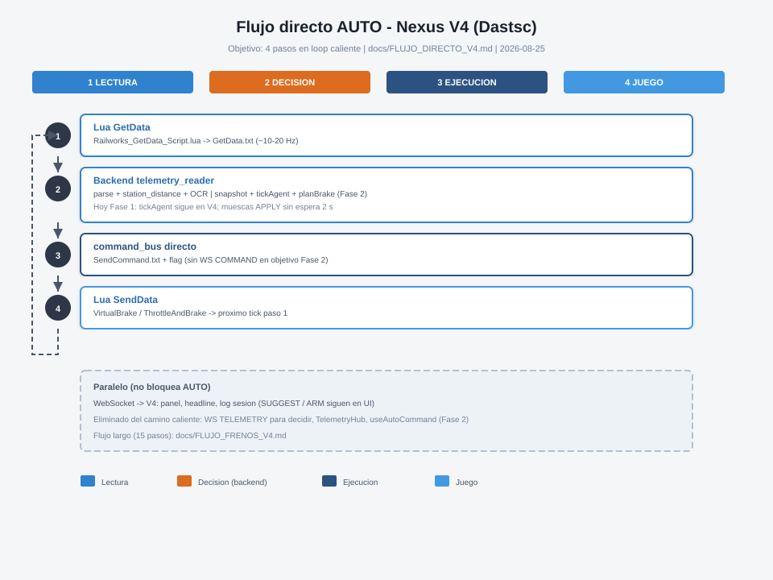

# Flujo directo AUTO — Nexus V4 (Dastsc)

**Objetivo:** menos saltos entre telemetría y mando, decisión más rápida y fiable en TSC.

**Alcance:** Nexus V4 · Train Simulator Classic (`C:\Users\doski\Dastsc`).

**Última revisión:** 2026-08-25 (reassert apply 500 ms)

---

## Problema del flujo actual

El diagrama [FLUJO_FRENOS_V4.md](./FLUJO_FRENOS_V4.md) tiene **15 pasos numerados** y **30** en detalle.
En modo **AUTO** el bucle crítico pasa por el navegador:

```text
GetData → backend → WebSocket → TelemetryHub (V4) → tickAgent → useAutoCommand
  → WebSocket COMMAND → command_bus → SendCommand → Lua
```

| Salto | Latencia típica | Riesgo |
| --- | --- | --- |
| IPC archivo GetData | 10–50 ms | Común a cualquier arquitectura |
| WS localhost ×2 | 1–5 ms c/u | Bajo, pero **V4 debe estar abierto** |
| React render + hooks | 1–3 ms/tick | Cola si pestaña inactiva |
| Rate limit AUTO 2 s (antes) | **hasta 2000 ms** | Freno tardío o muesca obsoleta |
| Sin V4 conectado | ∞ | AUTO no manda |

El cuello de botella **no** es el WebSocket en sí: es depender del frontend para decidir y mandar,
más el rate limit global que retrasaba **cualquier** cambio de muesca.

---

## Flujo objetivo (5 pasos)

Mismo algoritmo (`nexus-agent`); menos capas en el camino caliente:

```text
┌──────────┬─────────────────────┬──────────────┬─────────┐
│ 1 LECTURA│ 2 DECISIÓN          │ 3 EJECUCIÓN  │ 4 JUEGO │
│ Lua      │ backend: snapshot   │ command_bus  │ Lua     │
│ GetData  │ + tickAgent + plan  │ SendCommand  │ SendData│
└──────────┴─────────────────────┴──────────────┴─────────┘
         ▲                                              │
         └──────────────────────────────────────────────┘

  Paralelo (no bloquea AUTO):
  WS → V4 solo observabilidad (headline, panel, log)
```



| Paso | Qué incluye | Elimina respecto al flujo largo |
| --- | --- | --- |
| **1** | `Railworks_GetData_Script.lua` → `GetData.txt` | — |
| **2** | `telemetry_reader`: parse, OCR, estación, **`tickAgent`**, `planBrake` | WS TELEMETRY para decidir · TelemetryHub · hooks React |
| **3** | `command_bus.dispatch_command` directo tras acción AUTO | WS COMMAND · `useAutoCommand` |
| **4** | Lua `SendData()` | — |
| **UI** | V4 recibe `AGENT_TICK` + telemetría slim (opcional) | No participa en mandos AUTO |

**SUGGEST / ARM** siguen en V4 (confirmación humana). Solo **AUTO** usa el camino corto.

---

## Rol de V4 — supervisión, no otro GUI

**No** se planea una GUI nueva (tipo consola tkinter aparte). **Sí** se sigue usando **Nexus V4**
(React, puerto 5175) como **panel de supervisión y mando humano**.

| Función | ¿Dónde? | ¿Obligatorio en AUTO? |
| --- | --- | --- |
| Elegir modo SUGGEST / ARM / **AUTO** | V4 `PolicyModeSelector` | Sí una vez (Fase 2: `SET_POLICY` → backend) |
| Perfil de tren | V4 `ProfileSelector` | Sí al arrancar sesión |
| Headline, horizonte, plan de freno | V4 `BrakePlanPanel` + barra | No — **solo visualizar** en AUTO directo |
| Velocidad, límites, estación, gradiente ± | V4 `DriveHudBar` | No — supervisión |
| Confirmar mando (ARM) | V4 `ArmActionBar` | Solo modo ARM |
| Anclar OCR manual | V4 botón en HUD | Opcional |
| Log sesión JSON | Backend + V4 (hoy); backend solo (Fase 2) | No — post-mortem |
| **Decidir y mandar en AUTO** | **Backend** (Fase 2) | V4 **no** envía `COMMAND` en AUTO |

```text
  Backend (loop caliente AUTO)          V4 (paralelo)
  ───────────────────────────          ──────────────
  GetData → tickAgent → SendCommand    WS ← AGENT_TICK + telemetría slim
                                       → mismos paneles que hoy
                                       → sin useAutoCommand en AUTO
```

**Puedes cerrar V4** y AUTO sigue (Fase 2). **Abrir V4** en marcha sirve para ver en tiempo real
qué decide el agente (`headline`, muesca activa, distancias OCR, `limits.upcoming`) y cambiar a
SUGGEST/ARM si quieres tomar el mando.

Sin V4 abierto sigues teniendo:

- `logs/nexus-v4/session_*.json` (backend escribe ticks en Fase 2)
- `logs/` backend / consola FastAPI
- TSC + Lua (telemetría y mandos)

**Resumen:** V4 pasa de “obligatorio en el loop” a **visualización + configuración + ARM/SUGGEST**.
No es un simulador aparte; es el mismo producto con el camino AUTO acortado por detrás.

---

## Fases de implementación

### Fase 1 — Ya aplicada (2026-08-25)

**`useAutoCommand`:** el intervalo de 2 s queda **solo** para reintentar **RELEASE/NEU** mientras
`stillBraking`. Las muescas B1–B3 se envían **en el mismo tick** que cambia `suggestedAction`.

| Antes | Después |
| --- | --- |
| Cualquier comando nuevo esperaba 2 s desde el anterior | APPLY inmediato al cambiar muesca |
| B3→B2 podía perderse 2 s | Escalado de freno en cadencia GetData (~50–100 ms) |
| NEU reintento 2 s | Igual (necesario si TSC no suelta a la primera) |

Archivo: `Dastsc-V4/src/hooks/useAutoCommand.ts`

**Corrección dedup (misma fecha):** la deduplicación por `command:value` impedía reenviar una muesca
si el sim aún no confirmaba freno — crítico porque `SendCommand.txt` es one-shot (Lua lo borra al
leer). Regla unificada en backend y fallback V4:

| Caso | Envío |
| --- | --- |
| Muesca nueva (B3→B2) | Inmediato |
| Misma muesca + `isBrakeApplied` | No |
| Misma muesca + sim sin freno | Reassert cada **500 ms** |
| OFF/NEU + `stillBraking` | Reintento cada **2 s** |

Implementación: `nexus-agent/src/command/autoCommandDispatch.ts`, `auto_loop.py`
(`AUTO_APPLY_RETRY_S`). Detalle: [FLUJO_FRENOS_V4.md](./FLUJO_FRENOS_V4.md) § paso 13 SVG.

### Fase 2 — Backend AUTO (P0.3) — implementado 2026-08-25

Mover el loop decisión→mando al **mismo proceso** que ya lee `GetData.txt`:

1. V4 envía `SET_POLICY` / `SET_GRADIENT_SIGN` por WS al conectar o cambiar modo.
2. `telemetry_reader` tras enriquecer telemetría (modo AUTO + sidecar activo):
   - sidecar Node (`nexus-agent/scripts/backend-sidecar.ts`) → `TelemetryHub` + `tickAgent`.
   - si `suggestedAction` → `command_bus.dispatch_command` directo.
3. Broadcast `AGENT_TICK` + `AUTO_COMMAND_ACK` a V4 (panel, log).

**Archivos:**

| Capa | Ruta |
| --- | --- |
| Sidecar Node | `nexus-agent/scripts/backend-sidecar.ts` |
| Loop Python | `Dastsc-V3/backend/core/auto_loop.py`, `core/agent_sidecar.py` |
| Integración | `Dastsc-V3/backend/main.py` (`SET_POLICY`, bucle telemetría) |
| V4 | `hooks/useAgent.ts`, `hooks/useAutoCommand.ts` |

**Requisito:** `npx` + `tsx` en PATH (arranca al lifecyle del backend).

**Fallback:** si el sidecar no arranca, `backendAutoActive=false` y V4 sigue mandando AUTO
(`useAutoCommand`).

**Validación pendiente:** AUTO en ruta con V4 cerrado; log `agent.headline` solo backend.

### Fase 3 — Telemetría slim (P2)

Payload WS reducido para UI: no reenviar campos crudos duplicados que el backend ya fusionó.
Decisión no depende del tamaño del JSON.

---

## Qué no eliminar (fiabilidad)

| Pieza | Motivo |
| --- | --- |
| OCR + `station_distance` en backend | Paradas comerciales; ya está en paso 2 objetivo |
| `command_bus` validación perfil | Evita mandos fuera de whitelist |
| Flag `NexusApplyCommands` en Lua | Seguridad: IA no manda sin flag |
| Guardias `gameLinked` / SAFETY | Pausa AUTO sin TSC o con evento seguridad |
| `brakeStats` + learning | Precisión plan; puede cargarse en backend (Fase 2) |
| Log sesión | Observabilidad; puede escribirse desde backend |

---

## Comparativa rápida

| | Flujo largo (actual) | Flujo directo (objetivo AUTO) |
| --- | --- | --- |
| Pasos decisión→juego | 15 | 4 |
| Procesos en loop caliente | Backend + browser | Backend |
| V4 obligatorio en AUTO | Sí | No |
| Latencia muesca APPLY | Hasta 2 s (fix Fase 1: ~1 tick) | ~GetData + parse |
| ARM / SUGGEST | V4 | V4 |

---

## Archivos relacionados

| Documento | Contenido |
| --- | --- |
| [FLUJO_FRENOS_V4.md](./FLUJO_FRENOS_V4.md) | Árbol completo actual (análisis detallado) |
| [flujo_frenos_v4.svg](./flujo_frenos_v4.svg) | Diagrama 15 pasos |
| [flujo_directo_v4.svg](./flujo_directo_v4.svg) | Diagrama 5 pasos (objetivo) |
| [PENDIENTES_V4.md](./PENDIENTES_V4.md) | P0.3 backend AUTO, P2 telemetría slim |
| [GUIA_TECNICA_IPC.md](./GUIA_TECNICA_IPC.md) | GetData / SendCommand / NEU |

---

## Criterio de éxito (AUTO en ruta)

1. Primera muesca B3/B2 llega al sim **&lt; 200 ms** tras cruzar umbral del plan (log `command` timestamp).
2. Escalado B3→B2→B1 sin huecos de 2 s artificiales.
3. (Fase 2) AUTO estable con V4 cerrado; log `session_*.json` con `agent.headline` desde backend.
4. NEU sigue reintentando cada 2 s si `stillBraking`; apply reassert cada 500 ms hasta confirmación.
