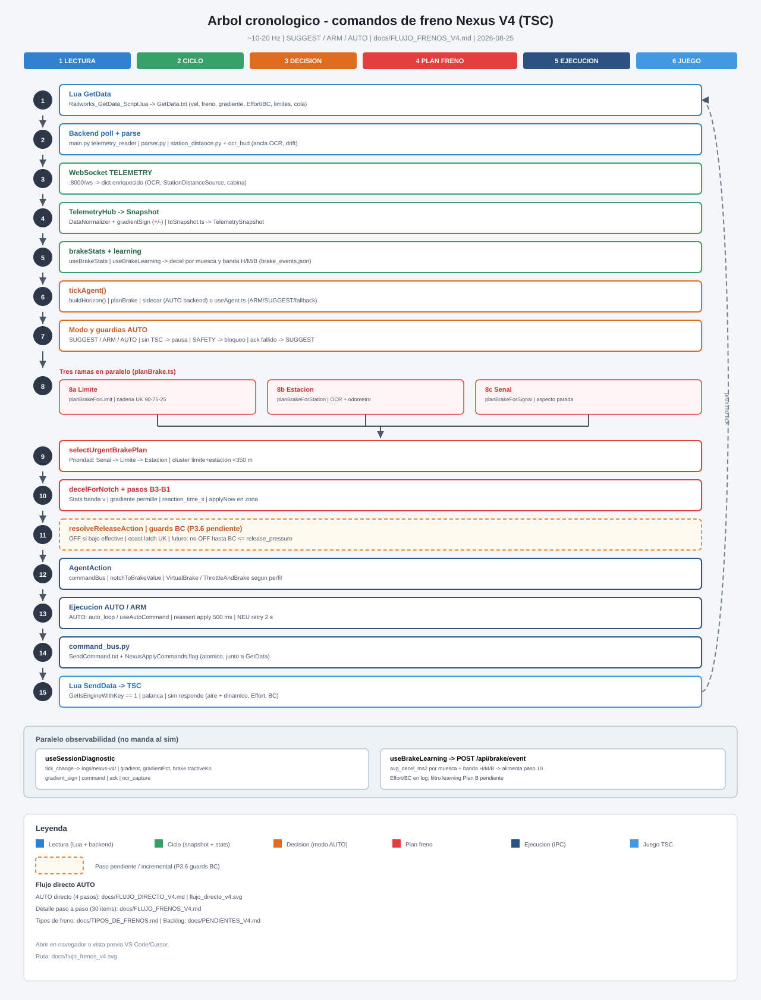
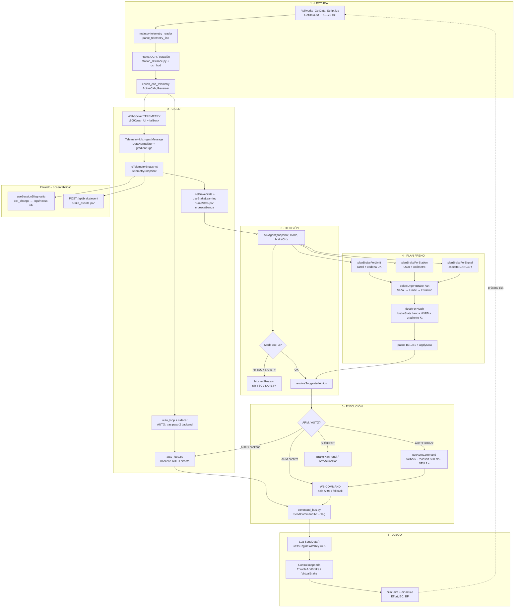

# Árbol cronológico — comandos de freno Nexus V4 (TSC)

**Producto:** Dastsc V4 · Train Simulator Classic  
**Cadencia:** ~10–20 Hz (Lua `delay=5` frames)  
**Modos:** SUGGEST (solo UI) · ARM (confirmar) · **AUTO** (manda solo)  
**Dos caminos AUTO (2026-08-25):**

| Camino | Cuándo | Doc |
| --- | --- | --- |
| **Directo (preferido)** | `backendAutoActive` + sidecar OK | [FLUJO_DIRECTO_V4.md](./FLUJO_DIRECTO_V4.md) · [flujo_directo_v4.svg](./flujo_directo_v4.svg) |
| **V4 (fallback)** | Sidecar no arranca | Pasos 5–13 de este árbol |

Este documento describe el **árbol completo** (15 pasos SVG / 30 detalle): útil para SUGGEST, ARM y
análisis del algoritmo. En AUTO normal el loop caliente va por backend (pasos 2 → sidecar → 14).

**Última revisión:** 2026-08-25 (dedup paso 13 · reassert con feedback telemetría)



> **Ver imagen:** abre `docs/flujo_frenos_v4.svg` en el navegador o en vista previa de VS Code/Cursor.
> Si no se renderiza en el visor Markdown, usa el SVG directamente.

---

## Vista general (6 bloques)

```text
┌─────────────┬──────────┬───────────┬──────────────┬─────────────┬──────────┐
│ 1 LECTURA   │ 2 CICLO  │ 3 DECISIÓN│ 4 PLAN FRENO │ 5 EJECUCIÓN │ 6 JUEGO  │
│ Lua + OCR   │ Snapshot │ tickAgent │ 3 ramas +    │ WS + Lua    │ TSC aplica│
│ + backend   │ + stats  │ + modo    │ selectUrgent │ SendCommand │ palanca   │
└─────────────┴──────────┴───────────┴──────────────┴─────────────┴──────────┘
```

---

## Diagrama Mermaid (flujo completo)



---

## Pasos numerados (detalle)

### 1 · LECTURA

| # | Componente | Entrada | Salida |
| - | ---------- | ------- | ------ |
| **1** | `lua/Railworks_GetData_Script.lua` | Controles TSC (velocidad, freno, gradiente, límites, cola, Effort/BC…) | Línea horizontal `GetData.txt` (`NexusLuaVersion:12`) |
| **2** | `backend/main.py` → `telemetry_reader` | Poll `GetData.txt` (mtime) | `dict` parseado (`parser.py`) |
| **3** | `station_distance.py` + `ocr_hud.py` | Puertas, HUD parada, botón **Anclar OCR** | `StationDistance`, `StationDistanceSource`, drift |
| **4** | `cab_inference.py` | `ActiveCab`, ruedas, reverser | Campos cabina enriquecidos (signo gradiente = UI V4) |

---

### 2 · CICLO

| # | Componente | Entrada | Salida |
| - | ---------- | ------- | ------ |
| **5** | WebSocket `:8000/ws` | `TELEMETRY` JSON | Raw + campos OCR |
| **6** | `TelemetryHub` (`useAgent.ts`) | Raw + perfil + `gradientSign` (+/−) | `TelemetryData` normalizado |
| **7** | `toSnapshot.ts` | Telemetría merged | **`TelemetrySnapshot`** estable |
| **8** | `useBrakeStats` / `useBrakeLearning` | Snapshot + perfil activo | `brakeStats` (global + `by_speed` H/M/B) |

**Estado inmutable del tren este ciclo:** `TelemetrySnapshot` + contexto `{ profile, commandProfile, brakeStats }`.

---

### 3 · DECISIÓN (modo y acción)

| # | Componente | Lógica |
| - | ---------- | ------ |
| **9** | `tickAgent()` | Orquesta horizonte + plan + acción sugerida |
| **10** | `buildHorizon()` | Cola ordenada: SAFETY, señal, límite, estación, cola |
| **11** | Política `PolicyMode` | **SUGGEST** → sin mando · **ARM** → clic V4 · **AUTO** → `auto_loop` (backend) o `useAutoCommand` (fallback) |
| **12** | Guardias AUTO | Sin `gameLinked` → pausa · `SAFETY` en horizon → bloqueo · ack fallido → fallback SUGGEST |

---

### 4 · PLAN FRENO (coordinador)

Cuatro ramas en paralelo; **una gana** (`selectUrgentBrakePlan`):

| # | Rama | Archivo | Objetivo | Estado |
| - | ---- | ------- | -------- | ------ |
| **13** | **Límite** | `planBrakeForLimit` | Cartel próximo + cadena UK (90→75→25) | ✅ |
| **14** | **Estación** | `planBrakeForStation` | Parada OCR (`ocr_tracker` / `lua`) | ✅ |
| **15** | **Señal** | `planBrakeForSignal` | Aspecto que exige parada (`signalUtils`) | ✅ parcial |
| **16** | **Planner largo** | `stationPlanHorizonM` + género | Horizonte 1500–2500 m según perfil | ✅ |

**Unificación (prioridad):**

1. Cluster límite+estación &lt; 350 m → excluir plan estación del pool  
2. Señal antes que límite si comparten bloque  
3. Desempate: **Señal (0) → Límite (1) → Estación (2)**

**Física por muesca (`planBrake.ts`):**

| # | Paso | Detalle |
| - | ---- | ------- |
| **17** | `decelForNotch(..., speedMs)` | Stats banda actual → fallback global → física perfil + `g×gradiente` |
| **18** | Pasos cinemáticos | B3 → B2 → B1; `applyNow` si dentro de zona + `reaction_time_s` |
| **19** | `resolveReleaseAction` | OFF/NEU si bajo objetivo **effective** (P1.6); coast latch UK |
| **20** | Salida plan | `BrakePlan.activeStep.notch`, distancias, `targetKind` |

**Pendiente (no en este árbol):** guards BC/BP (P3.6) · filtrar learning por Effort (Plan B).

---

### 5 · EJECUCIÓN

| # | Componente | Entrada | Salida |
| - | ---------- | ------- | ------ |
| **21** | `resolveSuggestedAction` | Plan activo + snapshot + alternates | `AgentAction { command, value, reason }` |
| **22** | `notchToBrakeValue` | Muesca + perfil | Valor 0–1 (combined negativo o VirtualBrake %) |
| **23** | `useAutoCommand` / `auto_loop` | AUTO: `shouldDispatchAutoCommand` / `should_dispatch` — ver § dedup paso 13 SVG |
| **24** | WebSocket `COMMAND` | Solo **ARM** y AUTO fallback; backend AUTO no usa WS |
| **25** | `command_bus.py` | Control + valor | `SendCommand.txt` + `NexusApplyCommands.flag` |
| **26** | Log sesión | `command` / `ack` / `auto_fallback` | `logs/nexus-v4/session_*.json` |

**Mandos permitidos AUTO v1:** muescas servicio + OFF/NEU · **sin EMG** · sin reverser.

#### Paso 13 SVG · deduplicación y reassert (2026-08-25)

En el diagrama [flujo_frenos_v4.svg](./flujo_frenos_v4.svg) el **paso 13** es «Ejecución AUTO / ARM»
(`useAutoCommand` o `auto_loop` → paso 14). Tras el paso 12 (`AgentAction`), decide **si** escribir
IPC este tick.

**Problema corregido:** `SendCommand.txt` es **one-shot** (Lua lo lee y borra en el paso 15). La
deduplicación antigua bloqueaba **todo** reenvío del mismo `command:value`, incluso cuando el sim
aún no había aplicado el freno (`stillBraking == false`).

**Regla actual** (`shouldDispatchAutoCommand` / `BackendAutoLoop.should_dispatch`):

| Situación | ¿Envía? | Intervalo |
| --- | --- | --- |
| Muesca **nueva** (p. ej. B3→B2, clave distinta) | Sí | Inmediato |
| Misma muesca + freno **confirmado** en telemetría | No | — |
| Misma muesca + sim **aún no frena** | Sí (reassert) | **500 ms** |
| OFF/NEU + sigue frenando | Sí | **2 s** |
| OFF + ya soltó | No | — |

**Feedback:** `isBrakeApplied(snapshot, profile)` — combined negativo (323) o `brake.position`
(SPLIT/Acela).

**Motivo del reassert 500 ms:** cubrir IPC perdido, lag de `brake_fill_time` y primer tick sin
confirmación; Lua también deduplica `SetControlValue` si el valor ya está en cabina.

**Archivos:** `nexus-agent/src/command/autoCommandDispatch.ts` (TS + tests Vitest),
`Dastsc-V3/backend/core/auto_loop.py` (`AUTO_APPLY_RETRY_S = 0.5`),
`Dastsc-V4/src/hooks/useAutoCommand.ts`.

**Histórico Fase 1:** se eliminó el throttle global de 2 s entre muescas distintas; solo NEU
retenía retry 2 s. Esta corrección extiende retry con feedback a **apply**.

---

### 6 · JUEGO (cierre del bucle)

| # | Paso | Detalle |
| - | ---- | ------- |
| **27** | Lua lee flag | Solo aplica IA si `NexusApplyCommands.flag` presente |
| **28** | `SendData()` | Escribe control (`VirtualBrake`, `ThrottleAndBrake`, …) |
| **29** | Sim TSC | Mezcla aire/dinámico según tren; actualiza Effort, BC, velocidad |
| **30** | Próximo tick | GetData actualizado → vuelta al paso **1** |

---

## Pasos SVG numerados (1–15)

Referencia rápida del diagrama [flujo_frenos_v4.svg](./flujo_frenos_v4.svg) (distinto del detalle
1–30 de las tablas anteriores):

| SVG | Bloque | Contenido |
| --- | --- | --- |
| **1** | Lectura | Lua GetData |
| **2** | Lectura | Backend poll + parse + OCR |
| **3** | Ciclo | WebSocket TELEMETRY |
| **4** | Ciclo | TelemetryHub → Snapshot |
| **5** | Ciclo | brakeStats + learning |
| **6** | Decisión | tickAgent() |
| **7** | Decisión | Modo y guardias AUTO |
| **8** | Plan | Tres ramas planBrake (límite / estación / señal) |
| **9** | Plan | selectUrgentBrakePlan |
| **10** | Plan | decelForNotch + pasos B3→B1 |
| **11** | Plan | resolveReleaseAction (+ P3.6 BC pendiente) |
| **12** | Ejecución | AgentAction (commandBus) |
| **13** | Ejecución | AUTO/ARM dispatch + **dedup/reassert** (§ arriba) |
| **14** | Ejecución | command_bus → SendCommand.txt + flag |
| **15** | Juego | Lua SendData → TSC → ↺ paso 1 |

---

No mandan al sim; alimentan precisión del paso **17**:

```text
Frenada detectada (Δv, muesca estable ≥1.5 s)
  → buildBrakeEventPayload (gradient, masa, banda v)
  → POST /api/brake/event
  → brake_events.json → GET /api/brake/stats
  → decelForNotch en el siguiente plan
```

Telemetría **Effort / BC** se registra en `tick_change` para análisis; **aún no** filtra eventos de learning.

---

## Flujo directo AUTO (implementado)

Ver [FLUJO_DIRECTO_V4.md](./FLUJO_DIRECTO_V4.md) — Fase 2 en backend (2026-08-25).

| Paso largo (este árbol) | Paso directo AUTO |
| --- | --- |
| 1–4 Lectura Lua + backend | **1** Lectura |
| 9–20 tickAgent + planBrake (sidecar) | **2** Decisión |
| 14 command_bus (sin 13 WS) | **3** Ejecución |
| 15 Lua SendData | **4** Juego |
| 5–8, 13 | Solo V4 supervisión o fallback |

---

## Archivos clave por bloque

| Bloque | Rutas |
| ------ | ----- |
| Lectura | `lua/Railworks_GetData_Script.lua`, `Dastsc-V3/backend/main.py`, `core/station_distance.py` |
| Ciclo | `nexus-kernel/TelemetryHub.ts`, `DataNormalizer.ts`, `toSnapshot.ts` |
| Agente | `nexus-agent/tick.ts`, `brake/planBrake.ts`, `command/commandBus.ts` |
| UI | `Dastsc-V4/hooks/useAgent.ts`, `useAutoCommand.ts`, `BrakePlanPanel.tsx` |
| Ejecución | `core/auto_loop.py`, `core/agent_sidecar.py`, `command_bus.py`, `nexus-agent/.../autoCommandDispatch.ts`, sidecar Node |
| Docs | [NEXUS_V4_ARQUITECTURA.md](./NEXUS_V4_ARQUITECTURA.md), [TIPOS_DE_FRENOS.md](./TIPOS_DE_FRENOS.md), [PENDIENTES_V4.md](./PENDIENTES_V4.md) |

---

## Puntos abiertos para análisis

Marcar en revisión conjunta:

- [ ] **P3.6** — insertar guard BC/BP entre pasos **19** y **23** (no OFF hasta cilindro bajo)
- [ ] **Plan B learning** — paso **8** → filtrar eventos con Effort/BC = 0 (Acela pre-fix)
- [ ] **P1.1** — validar cadena UK en paso **13** con log `limits.upcoming`
- [ ] **Consist doble** — paso **17** con salto de masa (P1.4)
- [ ] **Señal** — ampliar aspectos / distancias en paso **15** si ruta lo exige

---

*Documento para revisión — anotar hallazgos en sesión `docs/debug/semana-04-agente-frenado/sesiones/`.*
